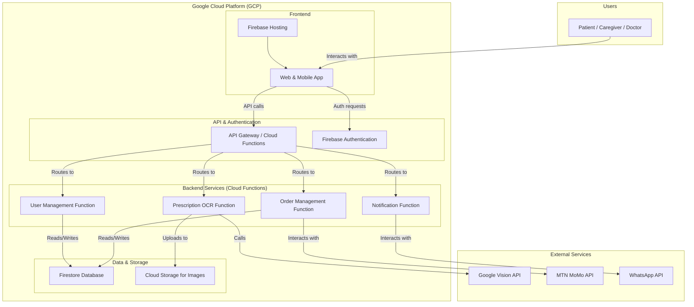

# PharmC Fullstack Architecture Document
**Version: 1.0**
**Date: July 21, 2025**

---

## Introduction
This document outlines the complete fullstack architecture for PharmC, including backend systems, frontend implementation, and their integration. It serves as the single source of truth for all development.

#### Change Log
| Date | Version | Description | Author |
| :--- | :--- | :--- | :--- |
| July 21, 2025 | 1.0 | Initial Architecture Draft | Winston, Architect |

---

## High Level Architecture

#### Technical Summary
The architecture for PharmC will be a modern, serverless system hosted entirely on the Google Cloud Platform. It will feature a monorepo containing a responsive web application, dedicated mobile frontends, and a backend powered by decoupled, event-driven functions. This approach is designed for rapid development, scalability, and cost-efficiency.

#### Platform and Infrastructure Choice
* **Platform:** Google Cloud
* **Key Services:** Google Cloud Functions, Firestore, Firebase Authentication, Google Cloud Storage, Firebase Hosting, Google Cloud Vision API.
* **Repository Structure:** We will use a **Monorepo** managed with **Turborepo** to simplify code sharing and streamline development.

#### High Level Architecture Diagram
